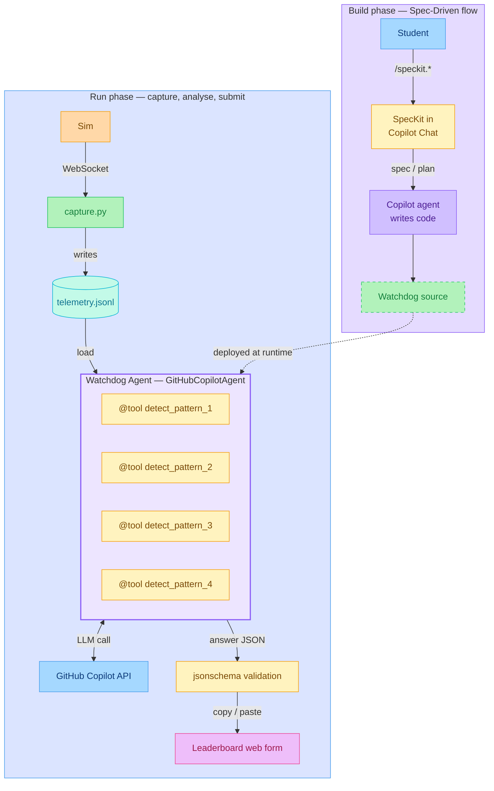

# System architecture

Two phases:

- **Build phase** — you drive SpecKit in Copilot Chat (`/speckit.*`),
  Copilot agent mode generates the Watchdog source.
- **Run phase** — you capture telemetry from the sim, the Watchdog
  agent (the source you just generated, now running) reads it, calls
  detection tools and the Copilot LLM, and emits a JSON answer that
  you copy/paste into the leaderboard web form.

## Reading the diagram

| Element | What it is |
|---|---|
| **Sim** | Black-box dependency (`sim` package, pinned to `v0.2.0`). Emits a merged WebSocket stream of nested per-scenario sub-objects. |
| **capture.py** | Reconnect-forever WebSocket client. Writes one JSONL frame per line. |
| **telemetry.jsonl** | Your captured frames — what every detector reads. |
| **Watchdog Agent** | A single `GitHubCopilotAgent` from `agent-framework-github-copilot`, with 4 `@tool`-decorated detector functions and a permission handler that approves all tool calls. |
| **GitHub Copilot API** | The LLM that decides which tools to call and assembles the final JSON. Auth via `make login`. |
| **jsonschema validation** | Last-line check against `specs/submission_schema.json` before you submit. |
| **Leaderboard web form** | The leaderboard collects `name` and `department` separately; you paste only the `answer` JSON. |
